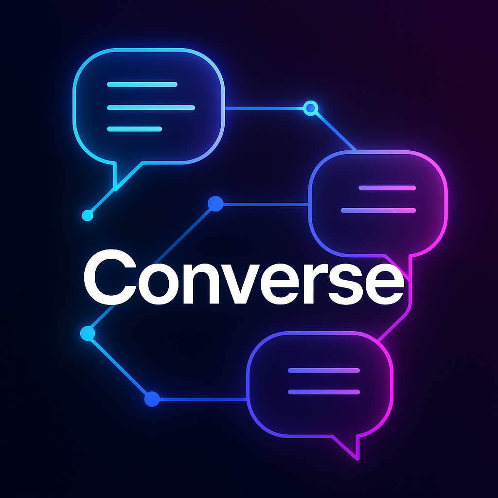

<p align="center">
  
</p>

<p align="center">
  <a href="https://github.com/elliottlawson/converse/actions/workflows/tests.yml"></a>
  <a href="https://packagist.org/packages/elliottlawson/converse"></a>
  <a href="https://packagist.org/packages/elliottlawson/converse"></a>
  <a href="https://packagist.org/packages/elliottlawson/converse"></a>
</p>

# Converse - AI Conversation Management for Laravel

**AI SDKs are great at sending messages, but terrible at having conversations.** 

Converse makes AI conversations flow as naturally as Eloquent makes database queries. Instead of manually managing message arrays and context for every API call, you just write `$conversation->addUserMessage('Hello')->send()`. The entire conversation history, context management, and message formatting is handled automatically.

## 📚 Documentation

**[View the full documentation](https://converse-php.netlify.app)** - Comprehensive guides, API reference, and examples.

## The Difference

Without Converse, every API call means manually rebuilding context:

```php
// Manually track every message 😫
$messages = [
    ['role' => 'system', 'content' => $systemPrompt],
    ['role' => 'user', 'content' => $oldMessage1],
    ['role' => 'assistant', 'content' => $oldResponse1],
    ['role' => 'user', 'content' => $oldMessage2],
    ['role' => 'assistant', 'content' => $oldResponse2],
    ['role' => 'user', 'content' => $newMessage],
];

// Send to API
$response = $client->chat()->create(['messages' => $messages]);

// Now figure out how to save everything...
```

With Converse, conversations just flow:

```php
// Context is automatic ✨
$conversation->addUserMessage($newMessage)->send();
```

That's it. **It's the difference between sending messages and actually having a conversation.**

## Features

- 💾 **Database-Backed Persistence** - Conversations survive page reloads and server restarts
- 🔌 **Provider Agnostic** - Works with OpenAI, Anthropic, Google, or any LLM
- 🌊 **Streaming Made Simple** - Automatic message chunking and progress tracking
- 📎 **File Attachments** - First-class support for multimodal AI
- 🚀 **Production Ready** - Soft deletes, UUIDs, events, and comprehensive metadata
- 🏗️ **Laravel Native** - Built with Eloquent, events, and broadcasting

## Installation

```bash
composer require elliottlawson/converse
```

Run the migrations:

```bash
php artisan migrate
```

## Quick Start

Add the trait to your User model:

```php
use ElliottLawson\Converse\Traits\HasAIConversations;

class User extends Model
{
    use HasAIConversations;
}
```

Start having conversations:

```php
$conversation = $user->startConversation(['title' => 'My Chat']);

$conversation
    ->addSystemMessage('You are a helpful assistant')
    ->addUserMessage('Hello!')
    ->addAssistantMessage('Hi! How can I help you today?');

// Continue the conversation anytime
$conversation->addUserMessage('Tell me about Laravel')->send();
```

## Requirements

- PHP 8.1+
- Laravel 10.0+

## Contributing

Please see [CONTRIBUTING](CONTRIBUTING.md) for details.

## Security

If you discover any security related issues, please email elliott.d.lawson@gmail.com instead of using the issue tracker.

## Credits

- [Elliott Lawson](https://github.com/elliottlawson)
- [All Contributors](../../contributors)

## License

The MIT License (MIT). Please see [License File](LICENSE) for more information. 